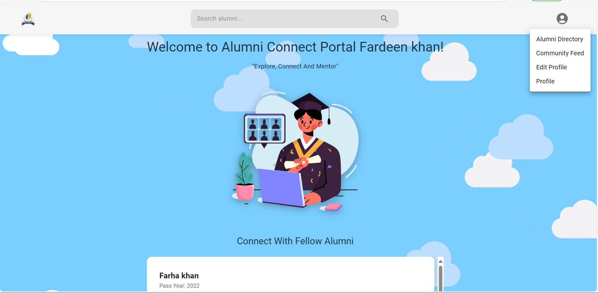
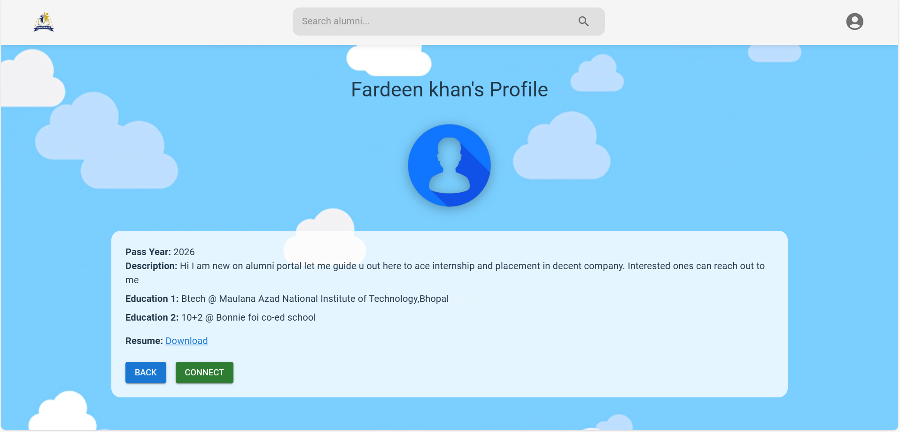

# 🎓 AlumniNet.io

A modern, responsive alumni networking platform to help former students reconnect, share experiences, and grow together.

## 🚀 Tech Stack

- **Frontend**: React + Vite  
- **UI Library**: Material UI (MUI)  
- **Authentication**: Firebase Auth (with automated session management)  
- **Database**: Firestore (NoSQL)  
- **Deployment**: [Vercel](https://alumninet.vercel.app/)  
- **Project Management**: Vite for fast development & modular structure  

## 🔐 Firebase Integration

- **Auth**: Secure Google/email-based login system  
- **Session Handling**: Firebase automatically manages user sessions  
- **Firestore**: Stores alumni data with scalable NoSQL schema  

## ✨ Features

- 🔍 **Alumni Search** – Instantly find alumni by name, batch, or branch  
- 📝 **Register** – Users can register with details like work, education, etc.  
- ✏️ **Edit Profile** – Update profile information any time  
- 🧑‍💼 **View Profiles** – Public profiles with social & work links  
- 💫 **Interactive UI** – Built with MUI components, smooth interactions  
- 📱 **Responsive Design** – Mobile-friendly layout  
- 🔒 **Automated Session Management** – Stay logged in via Firebase listener  

## 📬 Future Scope

- 📍 Location-based alumni discovery  
- 🎥 Real-time chat / video meet integration  
- 📝 Event announcements  
- 📰 Alumni blogs and stories  

## 🙌 Made With

Crafted with ❤️ by Fardeen khan
## UI pics

##

## 
 
##

